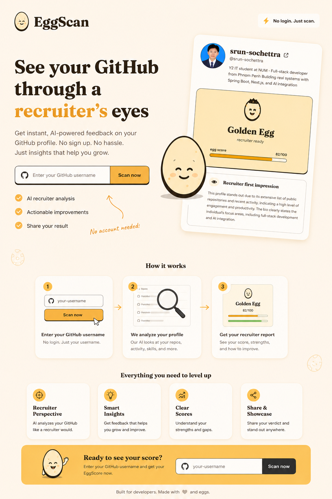

# 🥚 EggScan



<div align="center">
  <p><strong>Instantly scan, audit, and analyze GitHub profiles, battles, commits, readmes, and tech stacks with Groq-powered AI.</strong></p>

  [](https://www.oracle.com/java/)
  [](https://spring.io/projects/spring-boot)
  [](https://react.dev/)
  [](https://vitejs.dev/)
  [](https://tailwindcss.com/)
  [](https://groq.com/)
</div>

---

## 📖 Table of Contents
- [✨ Core Features](#-core-features)
- [🥚 The Egg Verdict System](#-the-egg-verdict-system)
- [🏗️ Project Architecture](#️-project-architecture)
- [🚀 Getting Started](#-getting-started)
  - [Prerequisites](#prerequisites)
  - [Backend Setup (Spring Boot)](#backend-setup-spring-boot)
  - [Frontend Setup (Vite + React)](#frontend-setup-vite--react)
- [⚙️ Configuration & Environment Variables](#️-configuration--environment-variables)
- [⚡ Performance & Technical Highlights](#-performance--technical-highlights)
- [🤝 Contributing](#-contributing)
- [🛡️ Security Policy](#️-security-policy)
- [📜 Code of Conduct](#-code-of-conduct)
- [📄 License](#-license)

---

## ✨ Core Features

*   **🔍 Profile Scanner**  
    Fetches user biography, pinned repositories, language distribution, and real-time contribution statistics via GitHub's GraphQL API. Deliver a humorous "roast" or professional constructive feedback.
*   **🥊 1v1 Battle Mode**  
    Pit two GitHub developers against each other! Compares their stats concurrently and generates a detailed, fun battle report determining the supreme winner.
*   **🔬 Repository Deep Dive**  
    Analyzes specific repositories by mapping their architecture, codebase structure, configuration files (`package.json`, `pom.xml`, etc.), and recent commit quality, providing actionable code improvements.
*   **🔥 CommitShame**  
    Rates commit message quality and calculates a **Laziness Score** (from 0 to 100). Exposes lazy commits in a dedicated "Hall of Shame".
*   **📝 READMErater**  
    Inspects your project/profile readmes, computes a **Uselessness Score**, and provides a list of direct nitpicks to improve your documentation.
*   **⚙️ StackRoast**  
    Analyzes your language distributions and configuration files to roast your tech stack choices.
*   **🎭 Multi-Persona Roaster**  
    Choose your roaster style! Available personas include:
    *   **Honest Reviewer**: Balanced, direct, and helpful.
    *   **Gordon Ramsay**: High-heat cooking roasts.
    *   **Disappointed Parent**: The guilt-trip audit.
    *   **Silicon Valley Tech Bro**: Web3, AI, and VC buzzwords galore.
    *   **Salty Pirate**: Nautical insults and high-seas programming wisdom.
*   **🎨 Glassmorphic React Dashboard**  
    A dark-themed, premium UI built with Vite and Tailwind CSS featuring interactive feedback cards, live loader animations, and responsive layouts.

---

## 🥚 The Egg Verdict System

EggScan grades your GitHub profile on a scale of **0 to 100** (the **Egg Score**) and assigns one of five egg-themed personality verdicts based on your codebase health, activity, and profile presentation:

| Verdict | Emoji | Score Range | Tagline | Description |
| :--- | :---: | :---: | :--- | :--- |
| **Golden Egg** | 🥚✨ | 80–100 | *recruiter ready* | Exceptional profile. Spotless repositories, active contributions, and perfect presentation. Ready for any recruiter. |
| **Hard Boiled** | 🍳 | 65–79 | *solid profile* | Strong developer presence. Solid repositories and consistent codebase patterns, with a few areas to polish. |
| **Fresh Egg** | 🐣 | 45–64 | *just getting started* | A budding developer profile. Shows clear potential and basic projects, but lacks depth or documentation. |
| **Cracked** | 🥚💔 | 25–44 | *needs work* | Incomplete or messy profile. Lacks pinned repositories, has sparse contributions, or needs major refactoring. |
| **Scrambled** | 🍳💀 | 0–24 | *do not apply yet* | Absolute chaos. Little to no activity, missing READMEs, or codebases that need immediate help. |

---

## 🏗️ Project Architecture

EggScan is structured as a monorepo containing decoupled backend (Java) and frontend (React) services:

```text
eggscan/
├── backend/                  # Spring Boot 3.3.4 (Java 21) REST API
│   ├── src/main/java/com/
│   │   └── eggscan/
│   │       ├── config/       # Security (CORS), GitHub, Thread Executors & Groq Config
│   │       ├── controller/   # REST Endpoints (/scan, /battle, /shame, /leaderboard, /health)
│   │       ├── dto/          # Data Transfer Objects (ScanResponse, BattleResponse, etc.)
│   │       ├── model/        # Entities for GitHub responses and Persistent Scans
│   │       ├── repository/   # Spring Data JPA Repository (ScanRecordRepository)
│   │       └── service/      # Logic (Groq, GitHub GraphQL/REST, Scan Orchestrator, ReadmeService)
│   ├── pom.xml               # Maven Dependency Management
│   ├── .env.example          # Environment Template for Backend
│   └── .env                  # Local Environment Variables (Git ignored)
│
├── frontend/                 # Vite + React Client
│   ├── src/
│   │   ├── api/              # API Integration Service (eggscan.js)
│   │   ├── components/       # Visual Cards, Verdicts, Forms, Battle & Animations
│   │   │   └── ScanResultComponents/ # Detailed layout cards (KeyRepositories, RepoItem, DetailedStats)
│   │   ├── pages/            # View Pages (Home, CommitShame, ReadmeRater, StackRoast)
│   │   ├── App.jsx           # React Routing (react-router-dom) Setup
│   │   ├── index.css         # Glassmorphism & Custom Tailwind CSS styles
│   │   └── main.jsx          # React Mounting Entry Point
│   ├── tailwind.config.js    # Design Tokens & Styles Configuration
│   └── package.json          # Node Dependencies & Custom Scripts
│
├── .gitignore                # Global Git Rules
├── CONTRIBUTING.md           # Collaboration Guidelines
├── CODE_OF_CONDUCT.md        # Participant Expectations
└── SECURITY.md               # Security Disclosures & Vulnerability Reporting
```

---

## 🚀 Getting Started

### Prerequisites
Before running the application, make sure you have installed:
*   [Java Development Kit (JDK) 21+](https://adoptium.net/temurin/releases/?version=21)
*   [PostgreSQL Database](https://www.postgresql.org/) (Running on localhost or accessible via cloud)
*   [Node.js 18+](https://nodejs.org/) (npm 9+)

---

### Backend Setup (Spring Boot)

1.  Navigate to the backend directory:
    ```bash
    cd backend
    ```
2.  Create your local environment file:
    ```bash
    cp .env.example .env
    ```
3.  Open `.env` and fill in your credentials (see [Configuration](#️-configuration--environment-variables) below):
    ```env
    GITHUB_TOKEN=your_personal_access_token
    GROQ_API_KEY=your_groq_api_key
    DB_URL=jdbc:postgresql://localhost:5432/postgres
    DB_USERNAME=postgres
    DB_PASSWORD=your_postgres_password
    ```
4.  Build and run the Spring Boot application using Maven:
    ```bash
    # If maven is installed globally:
    mvn clean spring-boot:run
    ```
    The server will start on **`http://localhost:8080`**. You can verify it is running by hitting the health check endpoint: [http://localhost:8080/api/health](http://localhost:8080/api/health).

---

### Frontend Setup (Vite + React)

1.  Navigate to the frontend directory:
    ```bash
    cd frontend
    ```
2.  Install the package dependencies:
    ```bash
    npm install
    ```
3.  Start the local development server:
    ```bash
    npm run dev
    ```
    The web client will launch on **`http://localhost:5173`** (or another port outputted to the console). It will automatically proxy API requests to the backend server.

---

## ⚙️ Configuration & Environment Variables

### Backend Configuration
The backend depends on the following keys set in `backend/.env`:

| Variable Name | Required | Description | Default | Link |
| :--- | :--- | :--- | :--- | :--- |
| `GITHUB_TOKEN` | **Yes** | Classic Personal Access Token or Fine-Grained Token to bypass rate limits. | N/A | [GitHub Settings](https://github.com/settings/tokens) |
| `GROQ_API_KEY` | **Yes** | Groq Cloud platform token used for fast Llama model queries. | N/A | [Groq Console](https://console.groq.com/keys) |
| `DB_URL` | No | PostgreSQL database connection URL. | `jdbc:postgresql://localhost:5432/postgres` | N/A |
| `DB_USERNAME` | No | Database username. | `postgres` | N/A |
| `DB_PASSWORD` | No | Database password. | (Empty) | N/A |

### Frontend Configuration
By default, the React client points to `http://localhost:8080`. If you run the API backend on a different port or host, specify it in your shell environment or a `.env` file inside the `frontend/` directory:

```env
VITE_API_URL=https://api.yourdomain.com
```

---

## ⚡ Performance & Technical Highlights

*   **CompletableFuture Concurrency**: Combines asynchronous thread pools to fetch user profiles and repository listings in parallel, speeding up the scan time by ~50%. Pit-stops for 1v1 battles are also fully parallelized.
*   **Reactive Network Config Fetching**: In deep-dive analysis, configuration files are scraped from repository structures using Non-blocking Spring WebClient and Project Reactor (`Flux.flatMapSequential`). This handles network-bound operations with maximum throughput and zero thread blocking.
*   **Caching Strategy**: Scans run in `honest` mode are persisted to PostgreSQL for 24 hours. Subsequent loads (e.g., via permalinks) are served directly from the cache to conserve API rate limits.
*   **Leaderboard Integration**: Cached profiles populate a top 10 leaderboard sorted by the highest Egg Scores.
*   **Resiliency & Defensiveness**: Configured explicit `responseTimeout` on WebClients to prevent thread starvation during GitHub API outages. Input validators strictly format usernames, repository names, and query parameter inputs.

---

## 🤝 Contributing
Contributions are what make the open-source community such an amazing place to learn, inspire, and create. Please read our [CONTRIBUTING.md](CONTRIBUTING.md) to learn how to open pull requests, submit issues, and write clean code for EggScan.

---

## 🛡️ Security Policy
If you discover a security vulnerability within EggScan, please review our [SECURITY.md](SECURITY.md) guidelines on how to report it privately. **Do not create public GitHub issues for security vulnerabilities.**

---

## 📜 Code of Conduct
We want to make participation in this project a welcoming and harassment-free experience for everyone. By collaborating on this project, you agree to adhere to the Contributor Covenant [CODE_OF_CONDUCT.md](CODE_OF_CONDUCT.md).

---

## 📄 License
Distributed under the MIT License. See `LICENSE` for more information.
